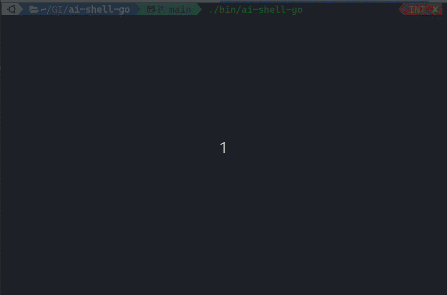

# 🤖 ai-shell-go

[](https://github.com/henomis/ai-shell-go/actions/workflows/release.yml) [](https://godoc.org/github.com/henomis/ai-shell-go) [](https://goreportcard.com/report/github.com/henomis/ai-shell-go) [](https://github.com/henomis/ai-shell-go/releases)

This is a simple AI shell helper written in GO. It uses OpenAI API to generate a plausible shell command from a given prompt.
As soon as the command is generated, the user can choose to execute it or revise it adding more context.




## Installation
Be sure to have a working Go environment, then run the following command:

```
$ go install github.com/henomis/ai-shell-go@latest
```

### From source code

Clone the repository and build the binary:

```
$ make
```

### Pre-built binaries

Pre-built binaries are available for Linux and macOS on the [releases page](https://github.com/henomis/ai-shell-go/releases/latest).


## Usage

⚠️ ai-go-shell requires an OpenAI API key as `OPENAI_API_KEY` environment variable.


```
$ ai-shell-go print first 3 lines of each file in a directory
```

### Output

```
    🤖 Here is your command line:

    $ head -n 3 *
    --
    This command uses the `head` utility to print the first 3 lines of each file in the current directory (`*` is a wildcard that matches all files in the directory). The `-n 3` flag specifies that it should print only the first 3 lines.

    [E]xecute, [R]evise, [Q]uit? > 
```